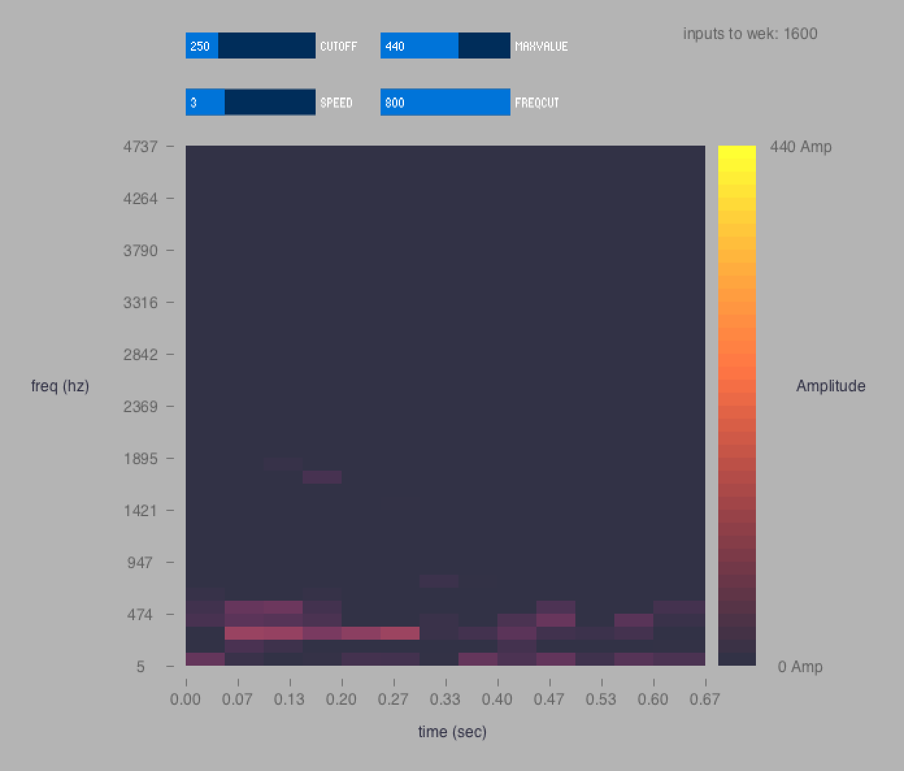

# Vroom Mobile

# Settings

* Mic gain: 48db

## Training

### Set1

* 1 background noise 440
* 2 Talking randomly 440
* 3 Starting: 110 samples per person
* 4 Acceleration: 220 samples per person
* 5 Breaking: 110 samples per person

### Set2 (Master1: Adaboost)

* +3 Starting: 110 samples per person

### Set3

### Set5

* start from set2 adaboost +

  * 5 braking + starting per person
  * 3 acceleration per person

* works with all of the team

### set&

* start from set5 + a few other persons
